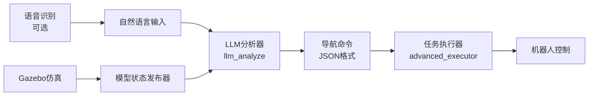

# LLM_ackermann_robot

<div align="center">

**🤖 基于大语言模型的阿克曼机器人自然语言导航系统**

*LLM-Powered Natural Language Navigation for Ackermann Steering Robot*

[](https://docs.ros.org/en/humble/)
[](LICENSE)
[](https://gazebosim.org/)

</div>

---

## 📖 项目简介 | Overview

本项目实现了一个基于大语言模型（LLM）的智能机器人导航系统，能够理解自然语言指令并控制阿克曼转向机器人在 Gazebo 仿真环境中完成复杂的导航任务。

**核心特性：**
- 🗣️ **自然语言交互**：支持中文语音/文本指令输入
- 🧠 **LLM 驱动**：使用 GPT/DeepSeek 等大模型进行指令解析
- 🚗 **阿克曼转向**：真实车辆物理模型，支持四轮转向约束
- 🏠 **语义导航**：理解"去茶几前面"、"走到两个球中间"等语义指令
- 🎯 **坐标导航**：支持精确坐标点导航
- 🔄 **复合任务**：支持多步骤任务序列执行
- 🎨 **轨迹绘制**：支持绘制曲线（如正弦曲线）

---

## 🎬 演示效果 | Demo

### 支持的指令示例

```bash
# 坐标导航
"去坐标(2,2)"
"走到(1.5,3.0)"

# 语义导航
"去茶几前面"
"走到两个球中间"
"去卧室的床边"

# 基础移动
"向前走3秒"
"左转90度"
"后退2米"

# 复合任务
"去坐标(2,2)，然后抬起机械臂"
"先去厨房，再去卧室"

# 轨迹绘制
"画一条sinx曲线，等待3s后返回"

# 相对移动
"朝左前方30度方向前进2m"

# 控制指令
"停止"
"等待5秒"
```

---

## 🏗️ 系统架构 | Architecture



### 核心模块

| 模块 | 功能 | 文件 |
|------|------|------|
| **LLM 分析器** | 将自然语言转换为结构化导航指令 | `api_invocation/src/llm_analyze.cpp` |
| **任务执行器** | 执行导航任务，控制机器人运动 | `api_invocation/src/advanced_executor.cpp` |
| **模型状态发布器** | 从 Gazebo 获取环境物体位置 | `api_invocation/src/model_state_publisher.cpp` |
| **坐标转换** | 将 /odom 话题转换为 TF | `api_invocation/src/odom_to_tf.cpp` |
| **语音输入** | 终端交互式语音命令输入 | `api_invocation/src/voice_input.cpp` |

---

## 🛠️ 环境要求 | Requirements

### 软件依赖

- **操作系统**：Ubuntu 22.04 LTS
- **ROS 版本**：ROS 2 Humble
- **仿真器**：Gazebo Classic / Gazebo Fortress
- **编译工具**：CMake 3.8+, GCC/Clang with C++17

### 依赖库

```bash
# ROS 2 基础包
ros-humble-desktop
ros-humble-gazebo-ros-pkgs
ros-humble-ros2-control
ros-humble-joint-state-publisher
ros-humble-robot-state-publisher
ros-humble-xacro

# 额外依赖
libcurl4-openssl-dev
libjsoncpp-dev
libopencv-dev
python3-matplotlib
python3-numpy

# 语音识别（可选）
python3-pyaudio
```

### API 配置

需要配置 LLM API 密钥（支持 OpenAI、DeepSeek 等兼容 API）：

编辑 `api_invocation/config/llm_params.yaml`：

```yaml
/llm_analyzer:
  ros__parameters:
    api_key: "your-api-key-here"
    api_url: "https://api.openai.com/v1/chat/completions"
    model: "gpt-3.5-turbo"  # 或 "deepseek-chat" 等
```

---

## 📦 安装步骤 | Installation

### 1. 创建工作空间

```bash
mkdir -p ~/ackermann_ws/src
cd ~/ackermann_ws/src
```

### 2. 克隆仓库

```bash
git clone https://github.com/unionfleet1208-beep/LLM_ackermann_robot.git
cd ~/ackermann_ws
```

### 3. 安装依赖

```bash
# 安装 ROS 2 依赖
rosdep install --from-paths src --ignore-src -r -y

# 安装系统依赖
sudo apt-get update
sudo apt-get install -y \
    libcurl4-openssl-dev \
    libjsoncpp-dev \
    libopencv-dev \
    python3-matplotlib \
    python3-numpy
```

### 4. 编译

```bash
cd ~/ackermann_ws
colcon build --symlink-install
source install/setup.bash
```

---

## 🚀 快速开始 | Quick Start

### 方式一：完整系统启动（推荐）

#### 步骤 1：启动 Gazebo 仿真环境

```bash
# 终端 1
source ~/ackermann_ws/install/setup.bash
ros2 launch api_invocation gazebo_simulation.launch.py
```

#### 步骤 2：启动 LLM 导航系统

```bash
# 终端 2
source ~/ackermann_ws/install/setup.bash
ros2 launch api_invocation llm_navigation.launch.py
```

#### 步骤 3：发送自然语言指令

```bash
# 终端 3：使用交互式输入
source ~/ackermann_ws/install/setup.bash
ros2 run api_invocation voice_input

# 或直接通过话题发布
ros2 topic pub --once /voice_command std_msgs/msg/String "{data: '去茶几前面'}"
```

### 方式二：手动逐个启动（调试用）

```bash
# 终端 1：Gazebo 仿真
ros2 launch api_invocation gazebo_simulation.launch.py

# 终端 2：模型状态发布器
ros2 run api_invocation model_state_publisher

# 终端 3：LLM 分析器
ros2 run api_invocation llm_analyze --ros-args --params-file src/api_invocation/config/llm_params.yaml

# 终端 4：任务执行器
ros2 run api_invocation advanced_executor

# 终端 5：语音输入
ros2 run api_invocation voice_input
```

---

## 🧪 测试示例 | Examples

### 示例 1：基础坐标导航

```bash
ros2 topic pub --once /voice_command std_msgs/msg/String "{data: '去坐标(2,3)'}"
```

### 示例 2：语义导航

```bash
ros2 topic pub --once /voice_command std_msgs/msg/String "{data: '走到两个红球中间'}"
```

### 示例 3：��合任务

```bash
ros2 topic pub --once /voice_command std_msgs/msg/String "{data: '先去茶几，等待5秒，然后去卧室'}"
```

### 示例 4：绘制正弦曲线

```bash
ros2 topic pub --once /voice_command std_msgs/msg/String "{data: '画一条sinx曲线'}"
```

### 可视化轨迹点

```bash
cd ~/ackermann_ws/src/LLM_ackermann_robot/api_invocation/src
python3 plot_point.py
```

---

## 📐 环境地图 | Environment Map

仿真场景包含以下区域和物体：

```
客厅区（Living Room）:
  - 茶几 (Coffee Table): (1.0, 1.5)
  - 沙发 (Sofa): (2.0, 3.0)
  - 红色球1-3 (Balls): 散布在各处

卧室区（Bedroom）:
  - 床 (Bed): (-4.0, 2.0)
  - 衣柜 (Wardrobe): (-5.0, 1.0)
  - 床头柜 (Nightstand): (-3.5, 2.5)

厨房区（Kitchen）:
  - 冰箱 (Refrigerator): (6.0, 1.0)
  - 橱柜 (Cabinet): (7.0, 2.0)

重要：区域间有墙壁阻隔，必须通过门口绕行！
  - 客厅↔卧室门口: (-2.0, -0.5)
  - 客厅↔厨房通道: (5.0, 1.0)
```

---

## 🔧 配置文件 | Configuration

### LLM API 配置

**文件：** `api_invocation/config/llm_params.yaml`

```yaml
/llm_analyzer:
  ros__parameters:
    api_key: "your-api-key"
    api_url: "https://api.openai.com/v1/chat/completions"
    model: "gpt-3.5-turbo"
    temperature: 0.1
    max_tokens: 2000
    system_prompt: |
      你是一个阿克曼结构智能车的导航与任务规划专家。
      请将用户的自然语言指令解析为 JSON 任务列表。
      ...（详细提示词见配置文件）
```

### 语音识别配置（可选）

**文件：** `api_invocation/config/voice_asr_params.yaml`

```yaml
/voice_input_asr_node:
  ros__parameters:
    baidu_api_key: "your-baidu-api-key"
    baidu_secret_key: "your-baidu-secret-key"
    audio_device: "default"
    sample_rate: 16000
```

---

## 📊 语言组成 | Language Breakdown

| 语言 | 占比 | 用途 |
|------|------|------|
| **C++** | 83.1% | 核心导航算法、ROS 2 节点 |
| **Python** | 8.2% | 可视化工具、启动脚本 |
| **CMake** | 5.1% | 编译配置 |
| **Dockerfile** | 2.4% | 容器化部署 |
| **Shell** | 1.2% | 构建和运行脚本 |

---

## 🐳 Docker 部署（可选）

### 构建镜像

```bash
cd ~/ackermann_ws/src/LLM_ackermann_robot/ackermann_v2
./build_docker.sh
```

### 运行容器

```bash
./run_docker.sh
```

---

## 📝 开发说明 | Development Notes

### 重要物理约束

⚠️ **阿克曼结构特性**：
- 无法原地旋转（类似真实汽车）
- 任何转弯指令必须同时包含线速度和角速度
- 严禁 `linear=0, angular≠0` 的组合


提示词配置位于 `api_invocation/config/llm_params.yaml` 的 `system_prompt` 字段。

### 推荐 LLM

- **DeepSeek Chat**：速度快，效果好（作者当前使用）
- **GPT-5.2**：效果最佳，但可能超时（网络不稳定时）

---

---

<div align="center">

**Built with ❤️ using ROS 2 and LLM**

</div>
